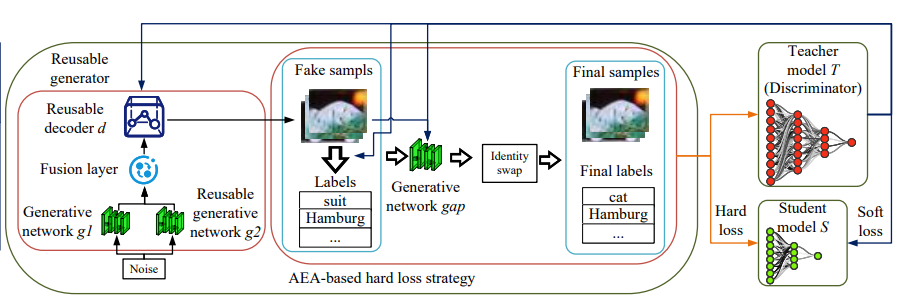
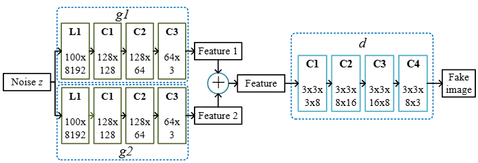

# Reusable generator data-free knowledge distillation with hard loss simulation for image classification
---
**This is the pytorch implementation of paper "Reusable generator data-free knowledge distillation with hard loss simulation for image classification"(updating).**
This paper introduces the reusable generator DFKD with the adversarial example attack-based hard loss strategy. This approach employs a generator consisting of two generative networks and a decoder. The decoder and one of the generative networks can be reused, they are initially trained on the previous task and then utilized in subsequent tasks. Additionally, we introduce the adversarial example attack to mimic the behavior of the teacher network in predicting real samples, ensuring that DFKD exhibits the hard loss similar to that of data-driven KD.
The proposed method is called RG-HLS. It's pipeline as shown is follows.


The structure of the reusable generator is shown below.


The method is divided into two modes.
- Anew mode. g1, g2, and d are randomly initialized.
Once training is complete,the trained d and one of [g1, g2] are output in addition to the student.
- Reuse mode. g1 is randomly initialized, while g2, and d are from the Anew mode task’s output. The training is then performed in the same way as in Anew mode.

In addition, Adversarial Example Attack are used to mimic the data-driven KD labels. Some of the results are shown below.


# Getting Started
1. Training the TEACHER model
   ```bash
   python train_scratch.py --model resnet34 --dataset cifar10 --batch-size 256 --lr 0.1 --epoch 200
   ```
   
   You can also use the pre-trained teacher model provided by [CMI](https://www.dropbox.com/sh/w8xehuk7debnka3/AABhoazFReE_5mMeyvb4iUWoa?dl=0)  directly. Place these models in 'checkpoints/pretrained/'.
2. Performing Data-Free Knowledge Distillation in Anew Mode
   ```bash
   python main.py --mode anew --dataset cifar10 --teacher resnet34 --student resnet18
   ```
   The results of the run, including reusable generative network, decoder, will be stored in 'run/Anew-cifar10-resnet34-resnet18/'.
3. Performing Data-Free Knowledge Distillation in Reuse Mode
    ```bash
    python main.py --hl --mode reuse_common --dataset cifar10 --teacher vgg11    --student resnet18 --reuse_generator_path run/anew-cifar10-resnet34-resnet18/gan_reuse.pth --reuse_decoder_path run/anew-cifar10-resnet34-resnet18/decoder.pth
    ```
# Ablation Experiment
You can run the following code to explore the effect of our strategy.
1. Effects in different reuse modes
     ```bash
    python main.py --hl --mode reuse_common --dataset cifar10 --teacher vgg11    --student resnet18 --reuse_generator_path run/anew-cifar10-resnet34-resnet18/gan_reuse.pth --reuse_decoder_path run/anew-cifar10-resnet34-resnet18/decoder.pth
    python main.py --hl --mode reuse_finetune --dataset cifar10 --teacher vgg11    --student resnet18 --reuse_generator_path run/anew-cifar10-resnet34-resnet18/gan_reuse.pth --reuse_decoder_path run/anew-cifar10-resnet34-resnet18/decoder.pth
    python main.py --hl --mode reuse_fix --dataset cifar10 --teacher vgg11    --student resnet18 --reuse_generator_path run/anew-cifar10-resnet34-resnet18/gan_reuse.pth --reuse_decoder_path run/anew-cifar10-resnet34-resnet18/decoder.pth
    ```
2. Effects in AEA-based HL Strategy
   ```base
   python main.py --mode reuse_common --hard_loss --dataset cifar10 --teacher vgg11 --student resnet18 --reuse_generator_path run/anew-cifar100-resnet34-resnet18/gan_reuse.pth --reuse_decoder_path run/anew-cifar100-resnet34-resnet18/decoder.pth >outs/reuse_common-hl-v11r18c100.txt 2>&1 &
   python main.py --mode reuse_common --hard_loss --no_aea --dataset cifar10 --teacher vgg11 --student resnet18 --reuse_generator_path run/anew-cifar100-resnet34-resnet18/gan_reuse.pth --reuse_decoder_path run/anew-cifar100-resnet34-resnet18/decoder.pth >outs/reuse_common-hl-v11r18c100.txt 2>&1 &
   ```
# Other Experiments
Our analysis and other experiments can be presented in the form of jupyter notebook. 
- bfa.ipynb shows the effect of attacking teachers with BFA using different data sources.
- convergency.ipynb organizes the convergence data for generator.
- teacher_behavior analyzes the teacher's predictive behavior.

# State
**Our code is based on [Fast-meta](https://github.com/zju-vipa/Fast-Datafree) and [CMI](https://github.com/zju-vipa/CMI), and part of the code is from [GAP]() and [DenseFuse](https://github.com/hli1221/densefuse-pytorch). We are sincerely grateful for the above work!**
